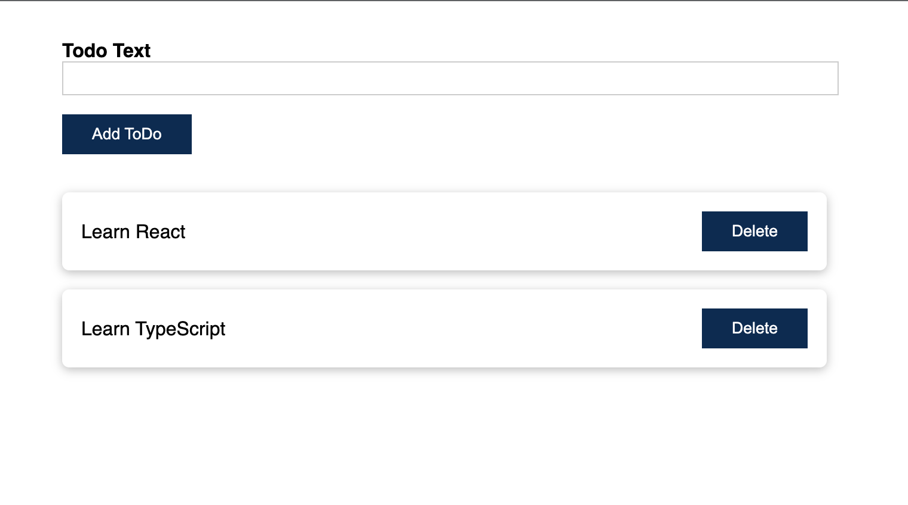

# React and Typescript

Part of "Understanding TypeScript learning" udemy course.

Simple React app with TypeScript and state management

## Used patterns and features

- React & TypeScript
- React state hooks & props
